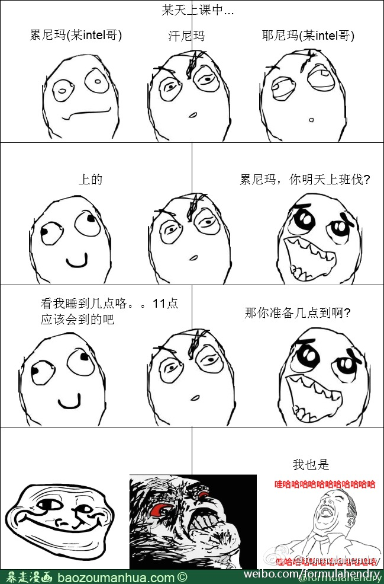

# 1155.Life

在建立 [955.WLB](https://github.com/formulahendry/955.WLB) 之初，[955.WLB](https://github.com/formulahendry/955.WLB) 被定位为 996.ICU 的反向 repo。现在想来，措辞略有不妥。996 是加班。955 是不加班也不养老，是一个中性词。而 11-5-5 才应该是和 996 相对标。

996 工作制：即每天早 9 点到岗，一直工作到晚上 9 点。每周工作 6 天。

955 工作制：即每天早 9 点到岗，一直工作到下午 5 点。每周工作 5 天。

11-5-5 工作制：即每天上午 11 点到岗，一直工作到下午 5 点。每周工作 5 天。

955.Life：工作 11-5-5，生活为先。

## 说明

11-5-5 是一种工作 Style，并不是说真的就是 11-5-5 工作制。可能有些公司的情况相对接近 945/10-5-5/11-5-5 的水平，但是依旧要看部门和地区，不能保证完全准确性。

* 不能保证所有部门都是 945/10-5-5/11-5-5 的水平
* 就算部门的平均水平是 945/10-5-5/11-5-5，也有可能部分时间要 955 甚至加班
* 名单中部分公司的部分部门可能有 965 甚至 975 的情况，不要以偏概全

## 11-5-5

* [上海三大 IT 养老院 ( IBM, Intel, EMC ) 的故事](https://www.zhihu.com/question/38934808/answer/588953577)
* [996 vs 11-5-5](https://www.zhihu.com/question/319774219/answer/649986978)

